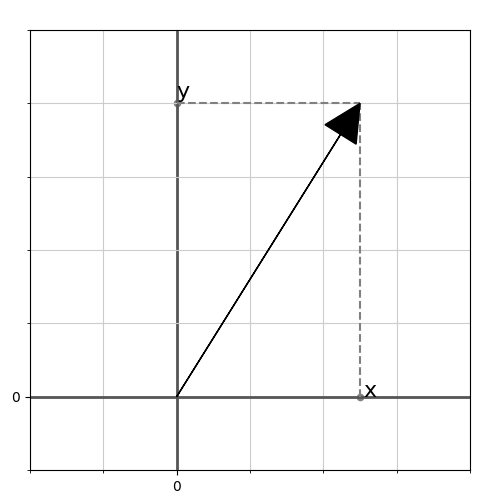

# Свой AR. Основы

В настоящий момент появилось достаточно большое количество библиотек дополненной реальности с богатым функционалом (ARCore, ARKit, Vuforia). Тем не менее я решил начать свой открытый проект, попутно описывая как это все работает изнутри. Если повезет, то позже получится добавить какой-то особый интересный функционал, которого нет в других библиотеках. В качестве целевых платформ пока возьмем Windows и Android. Библиотека пишется на C++, и сторонние библиотеки будут задействованы по минимуму, т.е. преимущественно не будет использовано ничего готового. Упор в статьях будет сделан на алгоритмы и математику, которые я постараюсь описать максимально доступно и подробно.

Дополненная реальность - это совмещение виртуального мира и реального. Для этого, нам нужно представить окружающее реального пространство в виде математической модели, понимая закономерности которой, мы сможем получить данные для совмещения. Начнем с векторной математики.

Вектора - это частный случай матриц, состоящие либо из одного столбца, либо из одной строки. Когда мы говорим вектор, обычно имеется вектор-столбец $\vec v = \begin{pmatrix}v_x \\ v_y \\ v_z \\v_w\end{pmatrix}$ (тут у нас 4-мерный вектор). Но записывать вектора как столбец неудобно, поэтому, записывая вектор, будем его транспонировать -- $\vec v = \begin{pmatrix}v_x & v_y & v_z & v_w\end{pmatrix}^T$.

### Длина вектора.
Первое, что на понадобится - получение длины вектора - $l = |\vec v|$, где $l$ - значение длины, $\vec v$ - наш вектор. Для примера пусть вектор будет двумерный:

$\vec v = (x, y)^T$, где $x$ и $y$ - компоненты вектора, значения проекций вектора на оси двумерных координат. И мы видим прямоугольный треугольник, где $x$ и $y$ - это длины катетов, $l$ - выходит длина его гипотенузы. По теореме Пифагора получается, что $l = \sqrt{x^2 + y^2}$. Значит $l = |\vec v| = \sqrt{x^2 + y^2}$. Вид формулы сохраняется и для векторов большей размерности, например -- $l = |\vec v| = |\begin{pmatrix} x & y & z & w\end{pmatrix}^T| = \sqrt{x^2 + y^2 + z^2 + w^2}$.

### Скалярное произведение.
Теперь разберемся с тем, что такое скалярное произведение векторов. Это сумма произведение их компонентов: $s = \vec a \cdot \vec b = a_x \cdot b_x + a_y \cdot b_y + a_z \cdot b_z$. Но так как мы знаем, что вектора - это матрицы, то тогда удобнее записать это в таком виде: $s = \vec{a}^T \vec{b}$. Это же произведение можно записать в другом виде: $s = {\vec a}^T \cdot \vec b = |\vec a| \cdot |vec b| \cdot cos(\delta)$, где $\delta$ - угол между векторами $\vec a$ и $\vec b$ (для двумерного случая эта формула доказывается через теорему косинусов). По этой формуле можно заключить, что скалярное произведение - это мера сонаправленности векторов. Ведь, если $\delta = 0^{\circ}$, то $cos(\delta) = 1$, и $s$ - это просто произведение длин векторов. Так как $cos(\delta)$ - не может быть больше 1, то это максимальное значение, которые мы можем получить, изменяя только угол delta. Минимальное значение $cos(\delta)$ будет равно -1, и получается при $\delta = 180^{\circ}$, т.е. когда вектора смотрят в противоположные направления. Также заметим, что при $\delta = 90^{\circ}$ $cos(\delta)=0$, а значит какие бы длины не имели вектора $\vec a$ и $\vec b$ -- $s = 0$. Можно в таком случае сказать, что вектора не имеют общего направления, и называются ортогональными. 
Также при помощи скалярного произведения, мы можем записать формулу длины вектора в более красивом виде: $|\vec v| = \sqrt{\vec{v}^T \vec v}$.

### Нормализованный вектор.

Предположим у нас есть некая фигура:

Picture 3.

Чтобы ее нарисовать, заданы координаты ее вершин, от которых строятся линии. Координаты заданы в виде набора векторов. Итак координаты наших вершин заданы таким образом v_i = (v_i_x, v_i_y)^T. 

