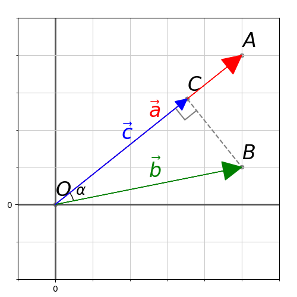
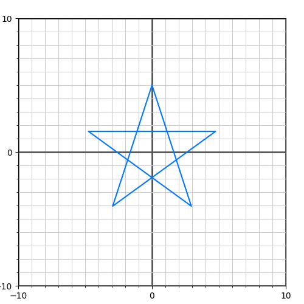

# Свой AR. Основы

В настоящий момент появилось достаточно большое количество библиотек дополненной реальности с богатым функционалом (ARCore, ARKit, Vuforia). Тем не менее я решил начать свой открытый проект, попутно описывая как это все работает изнутри. Если повезет, то позже получится добавить какой-то особый интересный функционал, которого нет в других библиотеках. В качестве целевых платформ пока возьмем Windows и Android. Библиотека пишется на C++, и сторонние библиотеки будут задействованы по минимуму, т.е. преимущественно не будет использовано ничего готового. Упор в статьях будет сделан на алгоритмы и математику, которые я постараюсь описать максимально доступно и подробно.

Дополненная реальность - это совмещение виртуального мира и реального. Для этого, нам нужно представить окружающее реального пространство в виде математической модели, понимая закономерности которой, мы сможем получить данные для совмещения. Начнем с векторной математики.

Вектора - это частный случай матриц, состоящие либо из одного столбца, либо из одной строки. Когда мы говорим вектор, обычно имеется вектор-столбец $\vec v = \begin{pmatrix}v_x \\ v_y \\ v_z \\v_w\end{pmatrix}$ (тут у нас 4-мерный вектор). Но записывать вектора как столбец неудобно, поэтому, записывая вектор, будем его транспонировать -- $\vec v = \begin{pmatrix}v_x & v_y & v_z & v_w\end{pmatrix}^T$.

### Длина вектора.
Первое, что на понадобится - получение длины вектора - $l = |\vec v|$, где $l$ - значение длины, $\vec v$ - наш вектор. Для примера пусть вектор будет двумерный:

$\vec v = (x, y)^T$, где $x$ и $y$ - компоненты вектора, значения проекций вектора на оси двумерных координат. И мы видим прямоугольный треугольник, где $x$ и $y$ - это длины катетов, $l$ - выходит длина его гипотенузы. По теореме Пифагора получается, что $l = \sqrt{x^2 + y^2}$. Значит $l = |\vec v| = \sqrt{x^2 + y^2}$. Вид формулы сохраняется и для векторов большей размерности, например -- $l = |\vec v| = |\begin{pmatrix} x & y & z & w\end{pmatrix}^T| = \sqrt{x^2 + y^2 + z^2 + w^2}$.

### Скалярное произведение.
Теперь разберемся с тем, что такое скалярное произведение векторов. Это сумма произведение их компонентов: $s = \vec a \cdot \vec b = a_x \cdot b_x + a_y \cdot b_y + a_z \cdot b_z$. Но так как мы знаем, что вектора - это матрицы, то тогда удобнее записать это в таком виде: $s = \vec{a}^T \vec{b}$. Это же произведение можно записать в другом виде: $s = {\vec a}^T \cdot \vec b = |\vec a| \cdot |vec b| \cdot \cos(\delta)$, где $\delta$ - угол между векторами $\vec a$ и $\vec b$ (для двумерного случая эта формула доказывается через теорему косинусов). По этой формуле можно заключить, что скалярное произведение - это мера сонаправленности векторов. Ведь, если $\delta = 0^{\circ}$, то $\cos(\delta) = 1$, и $s$ - это просто произведение длин векторов. Так как $\cos(\delta)$ - не может быть больше 1, то это максимальное значение, которые мы можем получить, изменяя только угол $\delta$. Минимальное значение $\cos(\delta)$ будет равно -1, и получается при $\delta = 180^{\circ}$, т.е. когда вектора смотрят в противоположные направления. Также заметим, что при $\delta = 90^{\circ}$ $\cos(\delta)=0$, а значит какие бы длины не имели вектора $\vec a$ и $\vec b$ -- $s = 0$. Можно в таком случае сказать, что вектора не имеют общего направления, и называются ортогональными. 
Также при помощи скалярного произведения, мы можем записать формулу длины вектора красивее: $|\vec v| = \sqrt{\vec{v}^T \vec v}$.

### Проекция вектора на другой вектор

Возьмем два вектора: $\vec a$ и $\vec b$. 
Проекцию вектора на дргуой вектор можно рассматривать в двух смыслах: геометрическом и алгебраическом. В геометрическом смысле проекция вектора на ось - это вектор, а в алгебраическом – число. 

Вектора - это направаления, поэтому их начало лежит в начасле кооржинат. Обозначим ключевые точки: $A$ - исходная точка, $B$ - конечная точка вектора $\vec a$, $C$ - конечная точка вектора $\vec b$. 

В геометрическом смысле мы ищем такой $\vec c$, чтобы конечная точка вектора (обозначим ее как - $D$) была ближайшей точкой к точке $C$, лежащей на прямой $AB$.
В 

В алгебраическом смысле мы хотим найти состовляющую $\vec b$ в $\vec a$, т.е. такое значение $t$, чтобы $\vec c = \vec a \cdot t$ и $|\vec c - \vec b| \rightarrow min$

Расстояние между точками $D$ и $C$ будет минимальным, если $\angle ADC = 90^\circ$. Получаем прямоуголный треугольник - $ADC$. Обозначим $\alpha = \angle DAC$. Мы значем, что $\cos{\alpha} = \frac{|AD|}{|AC|}$ по определению косинуса через соотношение сторон прямоугольного треугольника ($AC$ - гипотенуза, $AD$ - прилежащий катет).
Также возьмем скалярное произведение $s = \vec a \cdot \vec b = |\vec a| \cdot |\vec b| \cdot \cos(\alpha)$. Отсюда следует, что $\cos(\alpha) = \frac {\vec a \cdot \vec b } {|\vec a| \cdot |\vec b|}$. А значит $\frac{|AD|}{|AC|} = \frac {\vec a \cdot \vec b } {|\vec a| \cdot |\vec b|}$. Тут вспоминаем, что $AD$ - это искомый вектор $\vec c$, а $AC$ - $\vec b$, и получаем $\frac{|\vec c|}{|\vec b|} = \frac {\vec a \cdot \vec b } {|\vec a| \cdot |\vec b|}$. Умножаем обе части на $|\vec b|$ и получаем - $|\vec c| = \frac {\vec a \cdot \vec b } {|\vec a|}$. Теперь мы знаем длину $\vec c$. Вектор $\vec c$ отличается от вектора $\vec a$ длинной, а значит через соотношение длин можно получить: $\vec c = \vec a \cdot \frac{|\vec c|}{|\vec a|^2}$. И мы можем вывести финальные формулы:  
$t = \frac {\vec a \cdot \vec b } {|\vec a|^2} = \frac {{\vec a}^T \vec b}{{\vec a}^T \vec a}$ и  
$\vec c = \vec a \cdot \frac {{\vec a}^T \vec b}{{\vec a}^T \vec a}$

### Нормализованный вектор.

Хороший способ упростить работу над векторами -- использовать вектора единичной длины. Возьмем вектор $\vec v$. Мы можем получить сонаправленный вектор $\vec nv$, который будет иметь единичную длину, для этого нужно просто вектор разделить на его длину: $\vec{nv} = \frac{\vec v}{|\vec v|}$. Эта операция называется нормализацией.  
Зная нормализованный вектор и длину исходного вектора, можно получить исходный вектор: $\vec v = \vec{nv} \cdot |\vec v|$.
Зная нормализованный вектор и исходный вектор, можно получить его длину: $|vec v| = {\vec v}^T \vec{nv}$.
Хорошим преимуществом нормализованных векторов является то, что сильно упрощается формула проекции (т.к. длина равна 1, то она сокращается). Проекция вектора $\vec b$ на $\vec a$ единичной длины:  
$t = \vec a \cdot \vec b = {\vec a}^T \vec b$  
$\vec c = \vec a \cdot {(\vec a}^T \vec b)$

### Двумерная матрица поворота
Предположим у нас есть некая фигура:

Чтобы ее нарисовать, заданы координаты ее вершин, от которых строятся линии. Координаты заданы в виде набора векторов. Итак, координаты наших вершин заданы таким образом $\vec v_i = ({v_i}_x, {v_i}_y)^T$. Наша координатная сетка задана двумя осями - единичными ортогональными (перпендикулярными) векторами. В двумерном пространстве к вектору можно получить два перпендулярных вектора такой же длины: $perp(\vec v) = \begin{pmatrix}\mp v_y & \pm v_x \end{pmatrix}^T$ - левый и правый перпендикуляры. Берем вектор, задающим ось $X$ - $\vec{aX}=\begin{pmatrix} 1 & 0 \end{pmatrix}^T$ и правый перпендикуляр - ось $Y$ - $\vec{aX}=\begin{pmatrix} 0 & 1 \end{pmatrix}^T$.  
Получим проекции на оси при помощи наших векторов, задающих оси:  
$x = \vec{aX}^T \vec{v_i} = \begin{pmatrix} 1 & 0 \end{pmatrix}^T \vec v = v_x$  
$y = \vec{aY}^T \vec{v_i} = \begin{pmatrix} 0 & 1 \end{pmatrix}^T \vec v = v_y$  
Сюрприз - они совпадают с компонентами наших векторов, которые уже и являются проекциями вектора на оси. 
Теперь попробуем как-то изменить нашу фигуру - повернем ее на угол $\alpha$. Для этого повернем векторы $\vec{aX}$ и $\vec{aY}$, задающих оси координат. Поворот вектора $\begin{pmatrix} 1 & 0 \end{pmatrix}^T$ (ось $X$ - $\vec{aX}$) задаются косинусом и синусом угла - $\vec{aX}=rotate(\begin{pmatrix} 0 & 1 \end{pmatrix}^T, \alpha) = \begin{pmatrix} \cos(\alpha) & \sin(\alpha) \end{pmatrix}^T$. А чтобы получить вектор оси $Y$, возьмем перпендикуляр от $\vec{aX}$: $\vec{aY}=\begin{pmatrix} -\sin(\alpha) & \cos(\alpha) \end{pmatrix}^T$. Выполнив эту трансформацию, получаем новую фигуру:  
$\vec{v_i'} = \begin{pmatrix} \vec{v_i}^T \vec{aX} & \vec{v_i}^T \vec{aY} \end{pmatrix}^T$  

Вектора $\vec{aX}$ и $\vec{aY}$ являются ортонормированным базисом, потому как вектора ортогональны между собой (а значит базис ортогонален), а вектора имеют единичную длину, т.е. нормированы.

Теперь мы говорим о нескольких системах координат - базовая система координат - назовем ее мировой, и локальную для нашего объекта, которую мы поворачивали. Также удобно объединить наш набор векторов в одну матрицу - $R = \begin{pmatrix} \vec{aX} & \vec{aY} \end{pmatrix} = \begin{pmatrix} \cos{\alpha} & -\sin(\alpha) \\ \sin(\alpha) & \cos(\alpha) \end{pmatrix}$  
Тогда $\vec{v_i'} = \begin{pmatrix} \vec{v_i}^T \vec{aX} & \vec{v_i}^T \vec{aY} \end{pmatrix}^T = \begin{pmatrix} \vec{aX} & \vec{aY} \end{pmatrix} \vec{v_i} = R \cdot \vec{v_i}$.
Короче $\vec{v_i'} = R \cdot \vec{v_i}$.  
Матрица $R$, состовляющая ортонормированный базис и описывающая поворот, называется матрицей поворота. Также имеет ряд полезных свойств, которые следует иметь ввиду:  
* $|R|=1|$ - определитель матрицы равен 1.
* $R^T = R^{-1}$. 
* $R^T R = R^{-1} R = I$, где $I$ - единичная матрица.  
$R^T R = \begin{pmatrix}\vec{aX} & \vec{aY}\end{pmatrix}^T \begin{pmatrix}\vec{aX} & \vec{aY}\end{pmatrix} = \begin{pmatrix}\vec{aX}^T\vec{aX} & \vec{aX}^T\vec{aY} \\ \vec{aY}^T\vec{aX} & \vec{aY}^T\vec{aY}\end{pmatrix} = \begin{pmatrix} 1 & 0 \\ 0 & 1 \end{pmatrix}$.
* $\vec{v'} = R \vec v \Rightarrow |\vec{v'}|=|\vec v|$, поворот не меняет длины вектора.
* зная $\vec{v'}$ и $R$, можем получить исходный вектор $\vec v$ - $\vec v = R^{-1} \vec{v'} = R^T \vec{v'}$. Т.е. умножая вектор на матрицу поврота мы выполняем преобразование координат вектора из локальной системы координат объекта в мировую, но также мы можем поступать и наоборот - преобразовывать мировые координаты в локальную систему координат объекта, умножая на обратную матрицу поврота. Эти моменты хорошо бы хорошо понимать.

Теперь попробуем повернуть наш объект два раза, первый раз на угол $\alpha$, второй раз на угол $\beta$. Матрицу, полученную из угла $\alpha$, обозначим как $R_a$, из угла $\beta$ - $R_b$. Распишем наше итоговое преобразование:  
$\vec{{v'}_i} = R_b R_a \vec{v_i}$. 

Обозначим $R_c = R_b R_a$, тогда $\vec{{v'}_i} = R_c \vec{v_i}$. И из двух операций мы получили одну. Так как поворот - это линейное преобразование (описали ее при помощи одной матрицы), множество преобразований можно описать одной матрицей, что сильно упрощает над ними работу.

### Масштабирование

Масштабировать объект достаточно просто, нужно только умножить координаты точек на коефициент масштаба: $\vec{v_i'} = s \cdot \vec{v_i}$. Если мы хотим масштабировать объект на разную величину по разным осям, то формула принимает вид: $\vec{v_i'} = \begin{pmatrix} s_x \cdot {v_i}_x & s_y \cdot {v_i}_y \end{pmatrix}^T$. Для удобства переведем операцию в матричный вид: $S = \begin{pmatrix} s_x & 0 \\ 0 & s_y \end{pmatrix}, \vec{v_i'} = S \cdot \vec{v_i}$.

Теперь предположим, что нам нужно повернуть и масштабировать наш объект. Нужно отметить, что если сначала масштабировать, а затем повернуть, то результат будет отличаться, от того рузультата, где мы сначала повернули, а затем масштабировали:

Сначала поворот, а затем масштабирование по осям:

Сначала масштабирование по осям, а затем поврот:

Как мы видим порядок опереций играет большое значение, и его нужно обязательно учитывать.  
Также здесь мы также можем объединять матрицы преобразования в одну:  
$\vec{{v'}_i} = S R \vec{v_i}, \space T_a = S R \Rightarrow \vec{{v'}_i} = T_a \vec{v_i}$  
$\vec{{v'}_i} = R S \vec{v_i}, \space T_b = R S \Rightarrow \vec{{v'}_i} = T_b \vec{v_i}$  
$T_a \neq T_b!$

Хотя в данном случае, если $s_x = s_y$, то $T_a = T_b$. Тем не менее, с порядком преобразований нужно быть очень аккуратным. Их нельзя просто так менять местами.

### Векторное произведение векторов

Перейдем в трехмерное пространство.

