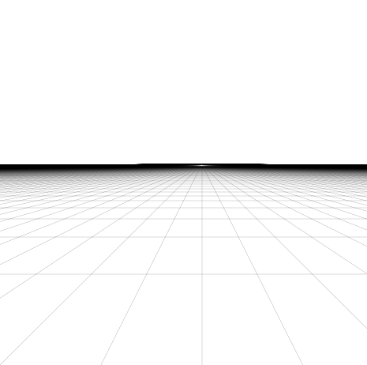

## Однородные координаты.  
В предыдущей статье мы рассматривали преобразования в евклидовом пространстве - $\mathbb{R}^2$, а сейчас ведем понятие проективного пространства - $\mathbb{P}^2$ (projective
space).  
Чтобы перевести координаты точки из двумерного евклидова пространства в проективное, нужно умножить вектор координат точки на любой ненулевой скаляр $w$, а затем добавить $w$ в качестве последней компоненты нового вектора: $\vec v = \begin{pmatrix} x & y \end{pmatrix}^T \in \mathbb{R}^2 \space \Rightarrow \space \vec p = \begin{pmatrix} x \cdot w & y \cdot w & w \end{pmatrix}^T \in \mathbb{P}^2$. Получаем однородные координаты точки (homogeneous coordinates). Так как $w$ - свободная переменная, то одной точке евклидова пространства принадлежит бесконечное множество точек проективного пространства. Перевод обратно выполняется делением на последнюю компоненту: $\vec p = \begin{pmatrix} x & y & w \end{pmatrix}^T \in \mathbb{P}^2 \space \Rightarrow \space \vec v = \begin{pmatrix} \frac{x}{w} & \frac{y}{w} \end{pmatrix}^T \in \mathbb{R}^2$. Удобно в качестве значения $w$ брать 1: $\vec v = \begin{pmatrix} x & y \end{pmatrix}^T \in \mathbb{R}^2 \space \Rightarrow \space \vec p = \begin{pmatrix} x & y & 1 \end{pmatrix}^T \in \mathbb{P}^2$. Перевод обратно в таком случае также упрощается: $\vec p = \begin{pmatrix} x & y & 1 \end{pmatrix}^T \in \mathbb{P}^2 \space \Rightarrow \space \vec v = \begin{pmatrix} x & y \end{pmatrix}^T \in \mathbb{R}^2$.   
Можно заметить, что умножение однородных координат на скаляр не меняет координат соответствующей точки в евклидовом пространстве: $\vec{p_B} = \vec{p_A} \cdot s = \begin{pmatrix} x \cdot s & y \cdot s & w \cdot s \end{pmatrix}^T \in \mathbb{P}^2 \space \Rightarrow \space \vec v = \begin{pmatrix} \frac{x \cdot s}{w \cdot s} & \frac{y \cdot s}{w \cdot s} \end{pmatrix}^T = \begin{pmatrix} \frac{x}{w} & \frac{y}{w} \end{pmatrix}^T \in \mathbb{R}^2$.  
Также, если последняя компонента равна 0, то такую точку мы не сможем перевести в евклидово пространство: $\vec p = \begin{pmatrix} x & y & 0 \end{pmatrix}^T \in \mathbb{P}^2$ – такая точка называется точкой на бесконечности (point at infinity или ideal point).  
Из уроков школьной геометрии вспомним уравнение линии: $y = k_{line} \cdot x + b_{line}$, где коэффициенты $k_{line}$ и $b_{line}$ определяют нашу линию. Переведем линии в другую форму: $a \cdot x + b \cdot y + c = 0$. Можем вывести соотношение этих коэффициентов: $a = k_{line}, \space b = -1, \space c = b_{line}$. Удобно перевести набор коэффициентов в вектор-строку: $l = \begin{pmatrix} a & b & c \end{pmatrix}$.   
Рассмотрим свойства точек и линий в проективном пространстве:  
* Если $a \cdot x + b \cdot y + c = 0$, то точка лежит на линии. В однородных координатах это можно записать в такой форме: $l \cdot \vec v = \begin{pmatrix} a & b & c \end{pmatrix} \cdot \begin{pmatrix} x \\ y \\ 1 \end{pmatrix} = 0$.
* Первые две компоненты линии $l$ ($a$ и $b$) - это вектор-перпендикуляр к этой самой линии в евклидовых координатах. Можно этот вектор нормализовать по этим компонентам, тогда компонента $с$ будет равна $\pm$ расстоянию линии до начала координат, а умножая вектор линии на вектор точки, получим $\pm$ расстояние от линии до точки: $l = \begin{pmatrix} a & b & c \end{pmatrix}, \space \vec v = \begin{pmatrix} x & y & 1 \end{pmatrix}^T, \space distance(l, \space \vec v) = (\frac{l}{|\begin{pmatrix} a & b \end{pmatrix}^T|}) \cdot \begin{pmatrix} x & y & 1 \end{pmatrix}^T$.  
* Вектор линии $l$ из двух точек $\vec{p_A}$ и $\vec{p_B}$ можно получить их векторным произведением: $l = (\vec{p_A} \times \vec{p_B})^T$.  

  

Доказательство
 
В результате векторного произведения получаем ортогональный к двум входным векторам вектор, а ортогональность однородных координат точки и вектора линии означает, что эта линии пересекает точку: $\vec l \cdot \vec{p_i} = 0$. Значит линия пересекает две исходные точки.

   
* Координаты точки пересечения $\vec p$ двух линий $l_A$ и $l_B$ можно получить их векторным произведением: $\vec{p} = \vec{{l_A}^T} \times \vec{{l_B}^T}$. 

Доказательство

Доказательство то же - получаем вектор ортогональный к векторам линии, а значит полученная точка пересекает наши две линии.

    
Также если линии параллельны, то $p_w = 0$ - а значит получим точку на бесконечности и не сможем перевести ее в евклидово пространство.  
* Возьмем две точки на бесконечности $\vec{p_A} = \begin{pmatrix} {p_A}_x & {p_A}_y & 0 \end{pmatrix}^T$, $\vec{p_B} = \begin{pmatrix} {p_B}_x & {p_B}_y & 0 \end{pmatrix}^T$ и найдем линию, пересекающую эти две точки: $l = (\vec{p_A} \times \vec{p_B})^T$. В результате получим линию, первые две компоненты вектора которой равны нулю: $l = (\vec{p_A} \times \vec{p_B})^T = \begin{pmatrix} 0 & 0 & {p_A}_x \cdot {p_B}_y - {p_A}_y \cdot {p_B}_x \end{pmatrix}$. Такую линию мы не сможем отобразить в евклидовом пространстве. Называется она линией на бесконечности (line at infinity). Она не имеет перпендикуляра и пересекается со всеми точками на бесконечности.  

## Трансформации в однородных координатах.  
Трансформации, которые мы делали в евклидовом пространстве, можно применять и для однородных координат.  
Для примера возьмем поворот точек матрицей поворота:  $\vec{v'} = R \vec{v} = \begin{pmatrix} R_{11} & R_{12} \\ R_{21} & R_{22} \end{pmatrix} \begin{pmatrix} v_x \\ v_y \end{pmatrix} = \begin{pmatrix} {v'}_x \\ {v'}_y \end{pmatrix}$.  
В однородных координатах это принимает такую форму:  $\vec{v'} = R \vec{v} = \begin{pmatrix} R_{11} & R_{12} & 0 \\ R_{21} & R_{22} & 0 \\ 0 & 0 & 1 \end{pmatrix} \begin{pmatrix} v_x \\ v_y \\ 1 \end{pmatrix} = \begin{pmatrix} {v'}_x \\ {v'}_y \\ 1 \end{pmatrix}$  
А смещение выполнялось следующим образом: $\vec{v'} = \vec v + \vec t$. Мы не могли преобразовать смещение объекта в матричную операцию, так как смещение - это нелинейная операция в евклидовом пространстве. Но уже в проективном пространстве она становится линейной $T$:  $\vec{v'} = \begin{pmatrix} 0 & 0 & t_x \\ 0 & 0 & t_y \\ 0 & 0 & 1 \end{pmatrix} \begin{pmatrix} v_x & v_y & 1 \end{pmatrix} = \begin{pmatrix} v_x + t_x \\ v_y + t_y \\ 1 \end{pmatrix}$.  
Из предыдущей статьи мы помним, что матричные операции, можно объединять. Объединим поворот и смещение:  
$\vec{v'} = T \cdot R \cdot \vec v = \begin{pmatrix} 0 & 0 & t_x \\ 0 & 0 & t_y \\ 0 & 0 & 1 \end{pmatrix} \cdot \begin{pmatrix} R_{11} & R_{12} & 0 \\ R_{21} & R_{22} & 0 \\ 0 & 0 & 1 \end{pmatrix} \cdot \begin{pmatrix} v_x \\ v_y \\ 1 \end{pmatrix} = \begin{pmatrix} R_{11} & R_{12} & t_x \\ R_{21} & R_{22} & t_y \\ 0 & 0 & 1 \end{pmatrix} \cdot \begin{pmatrix} v_x \\ v_y \\ 1 \end{pmatrix}$  
Пусть $P = T \cdot R$, тогда $\vec{v'} = P \cdot \vec{v}$, где $P = \begin{pmatrix} R_{11} & R_{12} & t_x \\ R_{21} & R_{22} & t_y \\ 0 & 0 & 1 \end{pmatrix}$.  
Отметим, что эти преобразования называют подобными, и они не меняют последнюю компоненту вектора: ${v_w}' = v_w$.

## Метод наименьших квадратов
Прежде чем двигаться дальше, вооружимся новым инструментом - методом наименьших квадратов (МНК).  
Возьмем для примера такую систему линейных уравнений:  
$\begin{cases} A_{11} \cdot x_1 + A_{12} \cdot x_2 = b_1 \\ A_{21} \cdot x_1 + A_{22} \cdot x_2 = b_2 \\ A_{31} \cdot x_1 + A_{32} \cdot x_1 = b_3\end{cases}$  
Эту систему можно представить в матричном виде:  
$\begin{pmatrix} A_{11} & A_{12} \\ A_{21} & A_{22} \\ A_{31} & A_{32} \end{pmatrix} \cdot \begin{pmatrix} x_1 \\ x_2 \end{pmatrix} = \begin{pmatrix} b_1 \\ b_2 \\ b_3 \end{pmatrix} = A \cdot \vec{x} = \vec{b}$.  
Неизвестных у нас два, количество уравнений - три, значит это переопределенная система уравнений, а значит решения одних уравнений может противоречить другим и система может не иметь точного решения. Ошибка получаемых решений - это обычное дело для вычислительной математики, нужно только ее минимизировать. В качестве ошибки возьмем сумму квадратов разницы: пусть $\vec{b'} = A \cdot \vec{x}$, $\vec{r} = (\vec{b'} - \vec{b})$ - вектор остатков, $e(\vec{x}) = \sum{{r_i}^2} = \sum{({b'}_i - b_i)^2}$ - функция ошибки. $e(\vec{x}) \rightarrow min$.   
В матричном виде задачу минимизации суммы отклонений можно записать так: $(A \vec x - \vec b)^T (A \vec x - \vec b) \rightarrow min$.  
Решение нашей системы:  
$A \cdot \vec x = \vec b \space \Rightarrow \space A^T \cdot A \cdot \vec x = A^T \vec b \space \Rightarrow \space \vec x = (A^T \cdot A)^{-1} \cdot A^T \cdot \vec b$  
$\vec x = (A^T A)^{-1} A^T \vec b$  
Метода несколько универсальнее, чем пример выше. Мы определили функцию ошибки как сумму квадратов остатков. Дальше нам нужно найти минимум этой функции. Минимум функции нужно искать в ее экстремумах. Экстремумы находятся там, где производные функции равны нулю:    
$\begin{cases}\frac{\partial e(\vec x)}{\partial x_0} = 0 \\ .. \\ \frac{\partial e(\vec x)}{\partial x_n} = 0 \end{cases}$  
Получим систему уравнений, которая в отличии от предыдущей, будет не переопределена. Если система уравнений - линейная, то решение будет только одно и получить его не составляет труда. Если решений несколько, то перебираем их и выбираем минимальное.   
Таким образом мы можем использовать этот метод для разных задач со своими условиями.   

## Немного практики
Перейдем наконец к практическим экспериментам. Для того, чтобы упростить себе работу, возьмем пока библиотеку OpenCV и используем ее для поиска маркеров. Найдем маркер и наложим на него картинку.     
Пусть $w$ и $h$ - ширина и высота картинки. Тогда четыре угла будут иметь следующие локальные координаты:  
$[\vec{v_1}, \vec{v_2}, \vec{v_3}, \vec{v_4}] = [\begin{pmatrix} 0 & 0 \end{pmatrix}^T, \begin{pmatrix} w & 0 \end{pmatrix}^T, \begin{pmatrix} w & h \end{pmatrix}^T, \begin{pmatrix} 0 & h \end{pmatrix}^T]$  
От OpenCV мы получаем координаты 4х углов маркера на изображении: $[\vec{m_1}, \vec{m_2}, \vec{m_3}, \vec{m_4}]$  
Для описания преобразования из локальных координат картинки в координаты изображения, возьмем два вектора $\vec{aX}$ и $\vec{aY}$, описывающих базовые оси $X$, $Y$ и вектор смещения от начала координат - $\vec{t}$:  
$\begin{pmatrix} {{m'}_i}_x \\ {{m'}_i}_y \\ 1 \end{pmatrix} = \begin{pmatrix} aX_x & aY_x & t_x \\ aX_y & aY_y & t_y \\ 0 & 0 & 1 \end{pmatrix} \begin{pmatrix} {v_i}_x \\ {v_i}_y \\ 1 \end{pmatrix}$  
Можем упростить формулу, вычеркнув последнюю строку:  
$\begin{pmatrix} {{m'}_i}_x \\ {{m'}_i}_y \end{pmatrix} = \begin{pmatrix} aX_x & aY_x & t_x \\ aX_y & aY_y & t_y \end{pmatrix} \begin{pmatrix} {v_i}_x \\ {v_i}_y \end{pmatrix}$  
$\vec{{m'}_i} = \begin{pmatrix} \vec{aX} & \vec{aY} & \vec t \end{pmatrix} \vec{v_i}$  
Одна пара точек задает два линейных уравнений, при этом имеем 6 неизвестных. Значит нужно 3 пары точек, чтобы система была определена. Мы имеем 4, а значит она переопределена. Воспользуемся МНК для нахождения нашего преобразования:  
Пусть искомый вектор $\vec x$ будет собран из наших неизвестных следующим образом $\vec x = \begin{pmatrix} aX_x & aY_x & t_x & aX_y & aY_y & t_y \end{pmatrix}^T$.
Исходя из такого вектора $\vec x$, матрица $A$, задающая нашу линейную систему уравнений будет иметь следующий вид:  
$A = \begin{pmatrix} {v_1}_x & {v_1}_y & 1 & 0 & 0 & 0 \\ 0 & 0 & 0 & {v_1}_x & {v_1}_y & 1 \\ ... \\ {v_4}_x & {v_4}_y & 1 & 0 & 0 & 0 \\ 0 & 0 & 0 & {v_4}_x & {v_4}_y & 1 \end{pmatrix}$  
А вектор $\vec b$ будет равен:  
$\vec b = \begin{pmatrix} {m_1}_x \\ {m_1}_y \\ ... \\ {m_4}_x \\ {m_4}_y \end{pmatrix}$  
Тогда, используя МНК, можем получить решение нашей системы: $\vec x = (A^T A)^{-1} A^T \vec b$. Отсюда получаем $\vec{aX}$, $\vec{aY}$ и $\vec{t}$.  
Пробуем!  
/// Видео  
Красным рисуются координаты маркера, полученного от OpenCV. В целом работает, но если взять низкий угол по отношению к маркеру, то видно, что искажения работают неправильно. А так получилось, потому что для моделирования пространственных искажений маркера мы использовали аффинную матрицу. Важное свойство аффинной матрицы - линии, полученные после преобразования, остаются параллельными. Однако обычно, смотря на параллельные линии на плоскости, мы видим такую картину:  
  
Параллельные линии при проецировании сходятся в одной точке, т.е. становятся не параллельными. Значит аффинной матрицы нам недостаточно.

 ## Direct linear transformation
Получить лучший результат нам поможет алгоритм, который называется Direct linear transformation.  
А описать перспективные искажения поможет перспективная матрица размером 3x3: $H = \begin{pmatrix} h_{11} & h_{12} & h_{13} \\ h_{21} & h_{22} & h_{23} \\ h_{31} & h_{32} & h_{33} \end{pmatrix}$.  
Перевод из евклидовых координат в однородные обозначим как $project$ и распишем полученное преобразование для наших $n$ точек ($i = 0...n$, а $n = 4$ в нашем случае):  
$\vec{p_i} = project(H \cdot \begin{pmatrix} {v_i}_x \\ {v_i}_y \\ 1 \end{pmatrix}) = \begin{pmatrix} \frac{ H_{11} \cdot {v_i}_x + H_{12} \cdot {v_i}_y + H_{13}}{H_{31} \cdot {v_i}_x + H_{32} \cdot {v_i}_y + H_{33}} & \frac{ H_{21} \cdot {v_i}_x + H_{22} \cdot {v_i}_y + H_{23}}{H_{31} \cdot {v_i}_x + H_{32} \cdot {v_i}_y + H_{33}} \end{pmatrix}^T$  
Представим наши уравнения в виде системы уравнений:  
$\begin{cases} ... \\ {p_i}_x = \frac{ H_{11} \cdot {v_i}_x + H_{12} \cdot {v_i}_y + H_{13}}{H_{31} \cdot {v_i}_x + H_{32} \cdot {v_i}_y + H_{33}} \\ {p_i}_y = \frac{ H_{21} \cdot {v_i}_x + H_{22} \cdot {v_i}_y + H_{23}}{H_{31} \cdot {v_i}_x + H_{32} \cdot {v_i}_y + H_{33}} \\ .. \end{cases} \Rightarrow \begin{cases} ... \\ {p_i}_x \cdot (H_{31} \cdot {v_i}_x + H_{32} \cdot {v_i}_y + H_{33}) = H_{11} \cdot {v_i}_x + H_{12} \cdot {v_i}_y + H_{13} \\ {p_i}_y \cdot (H_{31} \cdot {v_i}_x + H_{32} \cdot {v_i}_y + H_{33}) = H_{21} \cdot {v_i}_x + H_{22} \cdot {v_i}_y + H_{23} \\ ... \end{cases}$  
 
$\begin{cases} ... \\ H_{11} \cdot v_x + H_{12} \cdot v_y + H_{13} - H_{31} \cdot v_x \cdot {p_i}_x - H_{32} \cdot v_y \cdot {p_i}_x - H_{33} \cdot {p_i}_x = 0 \\ H_{21} \cdot v_x + H_{22} \cdot v_y + H_{23} - H_{31} \cdot v_x \cdot {p_i}_y - H_{32} \cdot v_y \cdot {p_i}_y - H_{33} \cdot {p_i}_y = 0 \\ ... \end{cases}$  

Представим матрицу $H$ как вектор $\vec{h} = \begin{pmatrix} H_{11} & H_{12} & H_{13} & H_{21} & H_{22} & H_{23} & H_{31} & H_{32} & H_{33} \end{pmatrix}^T$.  
Теперь систему уравнений можно перевести в матричный вид: $A = \begin{pmatrix} ... \\ v_x & v_y & 1 & 0 & 0 & 0 & - v_x \cdot {p_i}_x & - v_y \cdot {p_i}_x & - {p_i}_x \\ 0 & 0 & 0 & v_x & v_y & 1 & - v_x \cdot {p_i}_y & - v_y \cdot {p_i}_y & - {p_i}_y \\ ... \end{pmatrix}$  
$A \cdot \vec{h} = \vec{0}$  
Получили однородную систему уравнений в которой нам неизвестен вектор $\vec{h}$ (т.е. матрица $H$). Однородную систему уравнений мы не сможем решить при помощи метода наименьших квадратов. Однако одно решение найти несложно - это нулевой вектор - $\vec{h} = \vec{0}$. Но такое решение нас не интересует. Если же система имеет какое-то ненулевое решение, то мы получаем сразу бесконечное множество решений. Пусть вектор $\vec{h}$ - ненулевое решение - $A \cdot \vec{h} = \vec{0}$. Теперь умножим вектор $\vec{h}$ на любой ненулевой скаляр $s$, система уравнений все равно останется справедливой, а $\vec{h} \cdot s$ - также будет еще одним решением системы: $A \cdot \vec{h} \cdot s = \vec{0}$. Так как мы работаем с однородными координатами, то умножение на скаляр ничего не меняет. Тем не менее, чтобы не работать сразу со множеством решений, будем искать только одно - пусть длина вектор будет равна единицы $|\vec{h}| = 1$.  
  
### Сингулярное разложение и решение однородных систем уравнений 
Решить однородную систему уравнений можно при помощи сингулярного разложения матрицы (singular value decomposition). Сингулярное разложение - это разложение вида: $svd(M) = U \cdot W \cdot V^T$, где $U$ и $V$ - ортонормальные матрицы, а $W$ - диагональная, при этом диагональные элементы больше либо равны нулю и располагаются в порядке убывания (сверху вниз). Если воспринимать матрицу как операцию трансформации векторов, то это разложение будет декомпозицией этой трансформации на три последовательных: поворот, масштабирование по осям, второй поворот. Матрицы $U$ и $V$ - это ортонормальные матрицы, а значит можно назвать их матрицами поворота. Только следует учитывать, что $|U| = \pm 1$ и $|V| = \pm 1$, а значит, например, если $M$ - имеет размер 3x3, то тройка базисных векторов и этих матриц поворота могут быть левосторонними.
Не будем останавливаться на том, как вычислять это разложение. В более-менее полноценных математических фреймворках оно будет реализовано. Например - [Eigen](https://eigen.tuxfamily.org/index.php?title=Main_Page).  
Воспользуемся этим разложением для полученной выше матрицы $A$: $svd(A) = U \cdot W \cdot V^T$. Лучшим решением для нашей системы уравнений $A \cdot \vec{h} = \vec{0}$, если $|\vec{h}| = 1$ - это последняя строка матрицы $V$: $\vec{h} = V_{n}$. А так как матрица $V$ - ортонормальная, то длина вектора, составленного из любого его столбца, будет равна как раз единице.  

    
Доказательство

    В процессе вычислений у нас всегда есть погрешность, а это значит после $A \cdot \vec{h}$ мы можем получить не нулевой вектор, хотя его компоненты должны быть близки к нулю. Нужно минимизировать получаемую погрешность, а для ее оценки воспользуемся обычной для таких вещей суммой квадратов: $\vec{e} = \sum{{e_i}^2} = \vec{e}^T \vec{e} \rightarrow min$.  
    $\vec{e} = H \cdot \vec{h} \Rightarrow \vec{e}^T \vec{e} = (H \cdot \vec{h})^T (H \cdot \vec{h}) = (U \cdot W \cdot V^T \cdot \vec{h})^T (U \cdot W \cdot V^T \cdot \vec{h}) \rightarrow min$  
    $E = \vec{e}^T \vec{e} = \vec{h}^T \cdot V \cdot W \cdot U^T \cdot U \cdot W \cdot V^T \cdot \vec{h}$, так как $U$ - ортонормальная матрица, то $U^T \cdot U = I$. Так как $W$ - диагональная матрица с ненулевыми элементами, расположенными по убыванию, то и $(W^T \cdot W)$ - также будет диагональной матрицей с ненулевыми элементами, расположенными по убыванию - это будет эквивалентно возведению в квадрат диагональных элементов матрицы. Обозначим $W^2 = W^T \cdot W$.  
    $E = \vec{e}^T \vec{e} = \vec{h}^T \cdot V \cdot W^2 \cdot V^T \cdot \vec{h} \rightarrow min$  
    Обозначим $\vec{c} = V^T \cdot \vec{h}$, заметим, что $V$ - не сохраняет длину вектора $\vec{h}$, значит $|\vec{c}| = 1$:  
    $E = \vec{c}^T \cdot W^2 \cdot \vec{c} \rightarrow min$.
    Представим диагональ матрицы $W$ как вектор $\vec{w}$. Тогда $E = \vec{c}^T \cdot W^2 \cdot \vec{c} = \sum{{c_i}^2 \cdot {w_i}^2} -> min$
    Теперь подумаем чему должен быть равен $\vec{c}$, чтобы $E$ стало минимальным. Так как значения в $\vec{w}$. Судя по $\sum{{c_i}^2 \cdot {w_i}^2}$, наибольший вклад должен вносить последняя компонента вектора $\vec{w}$. Так как $|\vec{c}| = 1$, то выходит $\vec{c} = \begin{pmatrix} 0 & ... & 0 & 1 \end{pmatrix}^T$.  
    $\begin{pmatrix} 0 & ... & 0 & 1 \end{pmatrix}^T = V^T \cdot \vec{h} \Rightarrow \vec{h} = V \cdot \begin{pmatrix} 0 & ... & 0 & 1 \end{pmatrix}^T$.  
    Из описанного выше делаем вывод, что $\vec{h} = V_n$ - это последний столбец матрицы $V$.

Возвращаемся к нашей системе уравнений $A \cdot \vec{h} = \vec{0}$. Решаем ее описанным выше способом, получаем вектор $\vec{h}$. Затем из этого уже получаем искомую матрицу $H$. Пробуем:  
/// Видео

Как мы видим стало заметно лучше и искажения уже похожи на правду.  
Соответствующий код для аффинных и перспективных искажений можно найти в тестах проекта - [sonar/tests/test_marker_transform](https://github.com/DistinctVision/sonar/tree/article2/tests)

## Pinhole camera model
Хорошо, мы получили матрицу, описывающую перевод координат углов маркера в координаты изображения кадра. Но непонятно, что с этой матрицей можно делать. Хотелось бы получить координаты камеры в пространстве. Чтобы их найти, построим математическую модель, которая будет описывать как точки мирового пространства проецируются на изображение камеры.  
В качестве модели формирования изображения возьмем центральную проекцию. Суть центральной проекции состоит в том, что все точки, которые формируют выходное изображение, формируют лучи, сходящиеся в одной точке - центре проекции. Примерно так лучи себя и ведут в модели глаза или в цифровой камере.  
Проецировать точки будем на плоскость, которая и будет формировать наше изображение. В качестве такой плоскости возьмем плоскость, заданную таким условием $z = 1$. В таком случае наша камера будет сонаправлена с осью $Z$:  

Зададим параметрически формулу луча, формирующего точку на проекции: $\vec{r} = \vec{v} \cdot t$, где $\vec{r}$ - координаты точки луча, $\vec{v}$ - координаты проецируемой точки, а $t$ - является свободным параметром. Если луч не лежит на нашей плоскости и не параллелен ей, то он будет пересекать ее только в одной точке. При этом мы знаем, что $r_z = 1$.  
$r_z = v_z \cdot t \Rightarrow 1 = v_z \cdot t \Rightarrow t = \frac{1}{v_z}$  
$\vec{r} = \vec{v} \cdot t = \vec{v} \cdot \frac{1}{v_z} = \begin{pmatrix} \frac{v_x}{v_z} & \frac{v_y}{v_z} & 1\end{pmatrix}$  
Получаем координаты спроецированной на плоскость точки: $\vec{p} = \begin{pmatrix} \frac{v_x}{v_z} & \frac{v_y}{v_z}\end{pmatrix}$. Ничего не напоминает? Это формула перевода из однородных координат в двумерные евклидовы. Получается, что трехмерные координаты можно воспринимать как однородные координаты, соответствущие двумерным евклидовым координатам на плоскости. А перевод из однородных координат в двумерные евклидовы координаты выполняет центральную проекцию. Можно сказать, что трехмерные евклидово пространство эквивалентно двумерному проекционному.
После проецирования точки на плоскость можно переводить ее в координаты изображения. Обычно координаты изображения определены следующим образом, где $width$ и $height$ - высота и ширина изображения:  
  
Пусть у нас для камеры задан угол обзора по горизонтали - $angle_x$.   
Масштабируем координату $x$ точки $p$ так, чтобы расстояние от крайней левой видимой точки камеры до крайней правой было равно ширине изображения. При проецировании имеем такую картину:  
   
Здесь $A, C$ - левая и правые крайние точки, $B$ - точка между ними, у которой координата $x = 0$, а $z = 1$. Угол $\angle{AOC} = angle_x$. При этом имеем треугольник $AOB$, у которого угол $\angle{ABO} = 90^{\circ}$, а угол $\angle{AOB} = \frac{angle_x}{2}$, так как $OB$ делит угол $\angle{AOC}$ пополам. Длина $OB$ равна 1. Отсюда через тангенс угла $\angle{AOB}$ найдем длину $AB$ - $\tan{angle{AOB}} = \tan{\frac{angle_x}{2}} = \frac{AB}{OB} = AB$. А уже отсюда $AC = 2 \cdot AB = 2 \cdot \tan{\frac{angle_x}{2}}$.  
После проецирования сводим диапазон координаты $x$ - $[- \tan{\frac{angle_x}{2}}, \tan{\frac{angle_x}{2}}]$ к диапазону $[- \frac{width}{2}, \frac{width}{2}]$:  
$f_x = \frac{width}{2 \cdot \tan{\frac{angle_x}{2}}}, \space x' = x \cdot f_x$  
Чтобы сохранить пропорции изображения, то координату $y$ мы должны масштабировать на ту же величину. Но на выходном изображении ось $Y$ направлена в обратную сторону (вниз). Чтобы отразить ось, умножим коэффициент масштаба по оси $Y$ на $-1$. Получаем такое преобразование:  
$f_y = - f_x, \space , \space \space y' = y \cdot f_y$  
$\vec{p'} = \begin{pmatrix} f_x \cdot p_x & f_y \cdot p_y \end{pmatrix}^T$  
А координаты видимого изображения получили такой диапазон:  
  
Получилось так, что центр изображения - нулевая точка. Чтобы получить нужные на координаты на изображении, сместим крайнюю левую точку в центр:
$\vec{p'} = \begin{pmatrix} f_x \cdot p_x & f_y \cdot p_y \end{pmatrix}^T + \begin{pmatrix} \frac{width}{2} & \frac{height}{2} \end{pmatrix}^T$   
Теперь центральная точка изображения будет иметь координаты $\begin{pmatrix} \frac{width}{2} & \frac{height}{2} \end{pmatrix}^T$, как ей и положено. Эта центральная называется оптическим центром, обозначим ее как $\vec{c} = \begin{pmatrix} \frac{width}{2} & \frac{height}{2} \end{pmatrix}^T$. И финальная формула преобразования в координаты изображения:  
$\vec{p'} = \begin{pmatrix} f_x \cdot p_x & f_y \cdot p_y \end{pmatrix}^T + \vec{c}$, где $f_x = \frac{width}{2 \cdot \tan{\frac{angle_x}{2}}}, \space f_y = - f_x$, а $\vec{c} = \begin{pmatrix} \frac{width}{2} & \frac{height}{2} \end{pmatrix}^T$.  
Также, как мы делали до этого, можно упростить преобразование, работая сразу с однородными координатами точки и трансформируя все выражения в матричную форму:  
Пусть $K = \begin{pmatrix} f_x & 0 & c_x \\ 0 & f_y & c_y \\ 0 & 0 & 1 \end{pmatrix}$, тогда $\vec{p'} = project(K \cdot \begin{pmatrix} p_x \\ p_y \\ 1\end{pmatrix})$.  
Возвращаемся немного назад. Вспоминаем, что трехмерном пространстве - это проективное пространство для плоскости,на которую мы проецируем. Т.е. трехмерные координаты - это однородные координаты. Тогда формула перевода из трехмерного пространства в координаты изображения при центральной проекции принимает вид:  
$\vec{p'} = project(K \cdot \begin{pmatrix} v_x \\ v_y \\ v_z \end{pmatrix}) = project(K \cdot \vec{v})$  
Матрицу $K$ - называют внутренними параметрами камеры (intrinsic camera parameters).
Эта марица может в себе иметь еще параметр $s_{skew}$:  
$K = \begin{pmatrix} f_x & s_{skew} & c_x \\ 0 & f_y & c_y \\ 0 & 0 & 1 \end{pmatrix}$.
Эффект от его применения чем схож эффектом от [rolling shutter](https://ru.wikipedia.org/wiki/%D0%A0%D0%BE%D0%BB%D0%BB%D0%B8%D0%BD%D0%B3-%D1%88%D0%B0%D1%82%D1%82%D0%B5%D1%80). На практике обычно этот параметр не учитывается и остается равно нулю.  
Следует учитывать, что формулы вычисления параметров $f_x, f_y, c_x, c_y$ справедливы, если мы хотим перевести именно в пиксельные координаты изображения. Но других случаях нам может быть нужно перевести в другую координатную систему, например, в текстурные координаты, где значения координат $x$ и $y$ меняются в диапазоне $[0, 1]$. Тогда эти параметрами будут уже другими.  
Погрешности на производстве при сборки камер немного сказываются и на получаемых с них изображениях, оптический центр смещается немного от центра изображения, а каждая камера имеет слегка отличающиеся внутренние параметры. Поэтому каждая камера калибруется индивидуально. Реализацию калибровки можно найти в [OpenCV](https://docs.opencv.org/master/dc/dbb/tutorial_py_calibration.html).  
В API Android OS и iOS можно найти методы получения внутренних параметров камеры, заданные производителем.  
Сейчас же предлагаю просто считать оптическим центром - центр изображения, а параметры $f_x, f_y$ подбирать "на глаз". Для начала хватит и такого варианта.  

## Перемещение камеры в пространстве  
Все относительно - и хотя наблюдатель перемещается в пространстве, а мир стоит на месте, мы также можем сказать, что движется мир, а наблюдатель остается на месте. Меняется только система координат, в которой происходит движение. Значит выберем ту, которая для нас удобнее. А удобнее нам оставить локальную систему координат на месте, и все остальное пусть движется вокруг нее. Движение у нас определяется поворотом и смещением - матрицей поворота $R$ и вектором смещения $\vec{t}$. Также считаем, что у нас есть внутренние параметры камеры, заданные матрицей $K$. Таким образом мы можем разбить процесс вычисления координат на изображении из мировых координат на два этапа:  
1. Перевод мировых координат $\vec{v}$ в локальные координаты камеры $\vec{v'}$ при помощи $R$ и $\vec{t}$: $\vec{v'} = R \cdot \vec{v} + \vec{t}$
2. Перевод из локальных координат камеры в пиксельные координаты изображения при помощи матрицы $K$: $\vec{p} = project(K \cdot \vec{v'})$

Как мы уже знаем, матрицу $R$ и вектор $\vec{t}$ можно объединить в одну матрицу, только для того, чтобы ее применить придется перевести $\vec{v}$ в однородные координаты: 
$\begin{pmatrix} {v'}_x \\ {v'}_y \\ {v'}_z \\ 1 \end{pmatrix} = \begin{pmatrix} R_{11} & R_{12} & R_{13} & t_x \\ R_{21} & R_{22} & R_{23} & t_y \\ R_{31} & R_{32} & R_{33} & t_z \\ 0 & 0 & 0 & 1 \end{pmatrix} \begin{pmatrix} v_x \\ v_y \\ v_z \\ 1 \end{pmatrix}$  
Мы знаем, что ${v'}_w = 1$ и нам необязательно ее вычислять, поэтому можем чуть сократить формулу:  
$\begin{pmatrix} {v'}_x \\ {v'}_y \\ {v'}_z \end{pmatrix} = \begin{pmatrix} R_{11} & R_{12} & R_{13} & t_x \\ R_{21} & R_{22} & R_{23} & t_y \\ R_{31} & R_{32} & R_{33} & t_z\end{pmatrix} \begin{pmatrix} v_x \\ v_y \\ v_z \\ 1 \end{pmatrix}$  
Более короткая версия этой же формулы:  
$\vec{v'} = [R | \vec{t}] \begin{pmatrix} \vec{v} \\ 1 \end{pmatrix}$  
Теперь мы можем объединить два этапа в одну формулу:  
$\vec{p} = project(K \cdot [R | \vec{t}] \begin{pmatrix} \vec{v} \\ 1 \end{pmatrix})$  
К этому моменту можно нас поздравить - мы построили математическую модель проецирования изображения камеры. Опираясь на нее далее мы сможем понять, что происходит в видеопотоке. А точнее нашей основной задачей станет поиск параметров $R$ и $\vec{t}$. Эти параметры называют внешними параметрами камеры (extrinsic camera parameters). Так как мы предположили, что камера остается на месте, а двигается окружающий мир, то $R$ - это не матрица поворота самой камеры, а вектор $\vec{t}$ - не координаты позиции камеры. Матрица $R$ - это поворот из мировых координат в локальные координаты камеры, а когда говорят о повороте объекта, то имеют ввиду поворот из локальных координат в мировые. Поэтому поворот камеры - это $R_{camera} = R^{-1}$. Вектор $\vec{t}$ - вектор смещения камеры. Позицию камеры в мировых координатах можем найти следуя такой логике: при переводе в локальные координаты позиция камеры должна стать нулевым вектором - $\vec{0} = R \cdot \vec{pos_{camera}} + \vec{t} \space \Rightarrow \space (\vec{0} - \vec{t}) = R \cdot \vec{pos_{camera}} \space \Rightarrow \space \vec{pos_{camera}} = - R^{-1} \cdot \vec{t}$.  

 ## Получаем координаты камеры от маркера  
Возвращаемся к предыдущему примеру. В нем мы нашли перспективную матрицу $H$, описывающую преобразования наших точек:  
$\vec{p_i} = project(H \cdot \begin{pmatrix} {v_i}_x \\ {v_i}_y \\ 1 \end{pmatrix})$  
Попробуем разобраться как эта формула соотноситься с нашей моделью: 
$\vec{p} = project(K \cdot [R | \vec{t}] \begin{pmatrix} \vec{v} \\ 1 \end{pmatrix}) = project(K \cdot \begin{pmatrix} R_{11} & R_{12} & R_{13} & t_x \\ R_{21} & R_{22} & R_{23} & t_y \\ R_{31} & R_{32} & R_{33} & t_z \end{pmatrix} \begin{pmatrix} v_x \\ v_y \\ v_z \\ 1 \end{pmatrix})$  
Точки маркера в нашем случае задаются двумерными координатами, так как они все лежат на плоскости, т.е. $v_z = 0$. А так как $v_z = 0$, то столбец $\begin{pmatrix} R_{13} \\ R_{23} \\ R_{33} \end{pmatrix}$ не вносит вклада в результат, а значит его можно вычеркнуть, сократив формулу:  
$\vec{p} = project(K \cdot \begin{pmatrix} R_{11} & R_{12} & t_x \\ R_{21} & R_{22} & t_y \\ R_{31} & R_{32} & t_z \end{pmatrix} \begin{pmatrix} v_x \\ v_y \\ 1 \end{pmatrix})$  
Пусть $H' = K \cdot \begin{pmatrix} R_{11} & R_{12} & t_x \\ R_{21} & R_{22} & t_y \\ R_{31} & R_{32} & t_z \end{pmatrix}$, тогда получаем:  
$\vec{p_i} = project(H' \cdot \begin{pmatrix} {v_i}_x \\ {v_i}_y \\ 1 \end{pmatrix})$  
Получили идентичную формулу. Но сделать вывод, что $H' = H$ - нельзя. При вычислении матрицы $H$ мы получили целое множество решений и выбрали из этого множества удобное для нас. При работе с однородными координатами умножение на скаляр не играет роли, но в нашей модели мы уже оперируем трехмерными евклидовыми координатами. Поэтому $s \cdot H' = H$. Отсюда:  
$H = s \cdot K [R | \vec{t}] = K \cdot \begin{pmatrix} s \cdot R_{11} & s \cdot R_{12} & s \cdot t_x \\ s \cdot R_{21} & s \cdot R_{22} & s \cdot t_y \\ s \cdot R_{31} & s \cdot R_{32} & s \cdot t_z \end{pmatrix}$.  
Пусть $T = K^{-1} \cdot H = \begin{pmatrix} s \cdot R_{11} & s \cdot R_{12} & s \cdot t_x \\ s \cdot R_{21} & s \cdot R_{22} & s \cdot t_y \\ s \cdot R_{31} & s \cdot R_{32} & s \cdot t_z \end{pmatrix} = K^{-1} \cdot H$  
Первые два столбца полученной матрицы составляют два базисных вектора матрицы поворота. Длины этих векторов должны быть равны единице. Отсюда мы можем найти параметр $s = |\begin{pmatrix} T_{11} & T_{21} & T_{31} \end{pmatrix}^T| = |\begin{pmatrix} T_{12} & T_{22} & T_{32} \end{pmatrix}^T|$. Из-за погрешностей вычислений первый и второй вариант вычислений будут давать немного разные варианты, поэтому возьмем среднее между ними: $s = \frac{|\begin{pmatrix} T_{11} & T_{21} & T_{31} \end{pmatrix}^T| + |\begin{pmatrix} T_{12} & T_{22} & T_{32} \end{pmatrix}^T|}{2}$.  
Теперь вычислим два базисных вектора матрицы поворота:  
$\vec{r_1} = \frac{\begin{pmatrix} T_{11} & T_{21} & T_{31} \end{pmatrix}^T}{|\begin{pmatrix} T_{11} & T_{21} & T_{31} \end{pmatrix}^T|}$  
$\vec{r_2} = \frac{\begin{pmatrix} T_{12} & T_{22} & T_{32} \end{pmatrix}^T}{|\begin{pmatrix} T_{12} & T_{22} & T_{32} \end{pmatrix}^T|}$  
$R = \begin{pmatrix} \vec{r_1} & \vec{r_2} & \vec{r_1} \times \vec{r_2} \end{pmatrix}$  
$\vec{t} = \frac{\begin{pmatrix} T_{13} & T_{23} & T_{33} \end{pmatrix}^T}{s}$  
$R_{camera} = R^{-1}, \space \vec{pos_{camera}} = - R^{-1} \cdot \vec{t}$  
Итак, мы получили координаты камеры в пространстве. Теперь можем передать эти координаты трехмерному движку, чтобы он вывел трехмерные модели поверх реального изображения. Например,можно сделать плагин для Unity:  

// Видео

Описать преобразование точек при помощи перспективной матрицы размером 3x3 можно только в случае, когда идет отображение точек с одной плоскости на другую. Такая матрица называется матрицей гомографии (homography matrix). В нашем случае шло отображение с плоскости маркера на плоскость проекции. Но в других случаях алгоритм 
direct linear transformation задействовать уже не получится и нужно будет искать другие способы.

